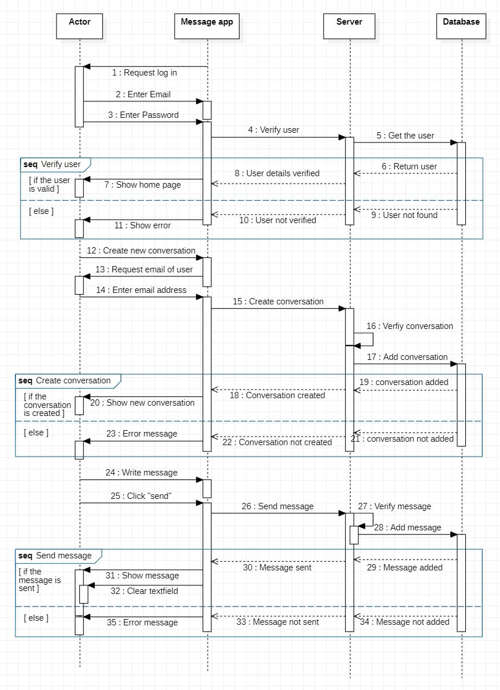

# Message App

Web application to send messages.

## 1. Technologies Used

Front-End:

- **React**: a front-end JavaScript library for building user interfaces based on components.

- **Less**: (Leaner Style Sheets) a backwards-compatible language extension for CSS.

- **Tailwind CSS**: a utility-first CSS framework.

Back-End:

- **Node.js**: a back-end JavaScript runtime environment, runs on the V8 JavaScript Engine, and executes JavaScript code outside a web browser.

- **Express.js**: a minimal and flexible Node.js web application framework that provides a robust set of features for web and mobile applications.

- **PostgreSQL**: a relational database management system.

- **Socket.IO**: a library that enables low-latency, bidirectional and event-based communication between a client and a server.

## 2. Implementation

     
    <i>ER Diagram - database</i>  
     
    <i>Sequence Diagram - User signs in and sends a message</i>

s
